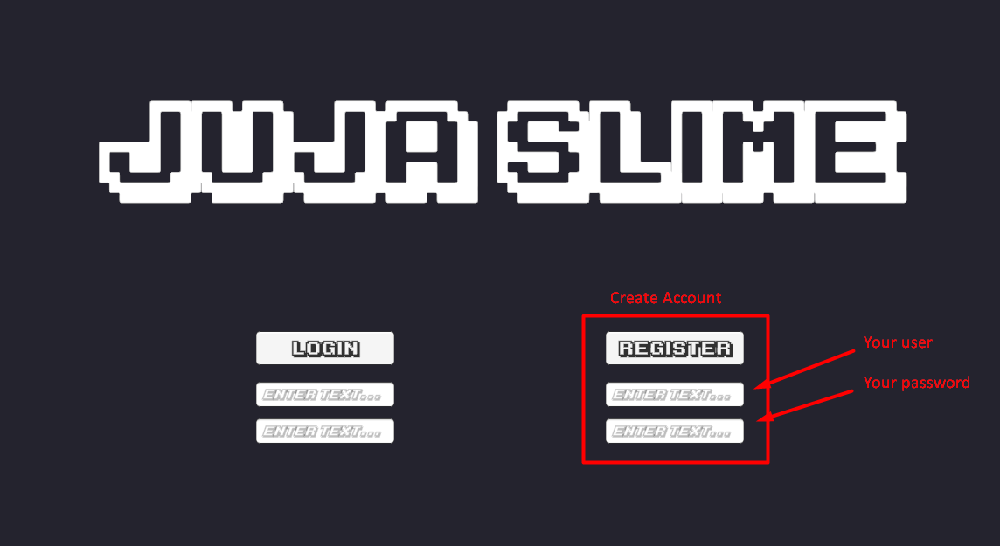
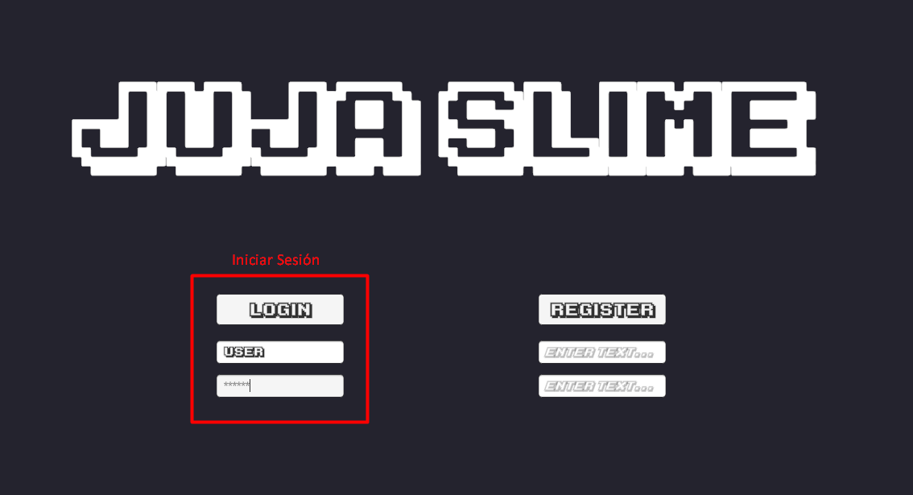
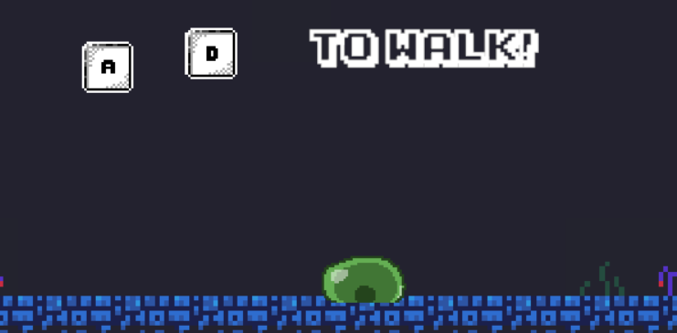
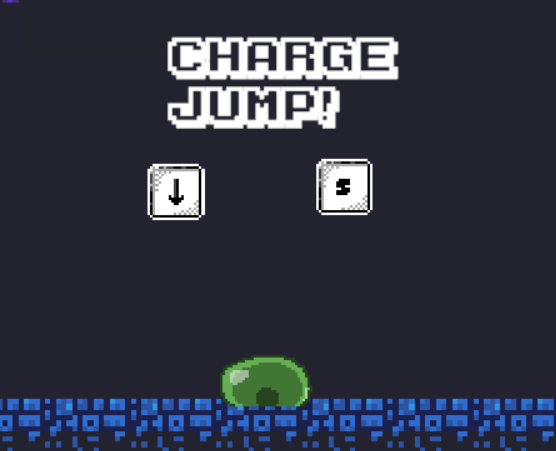
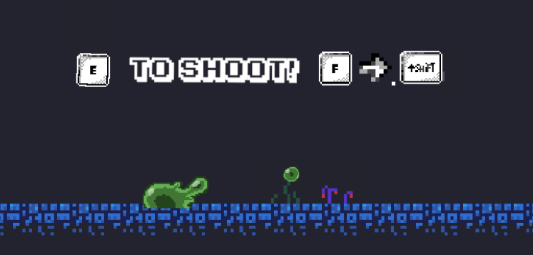
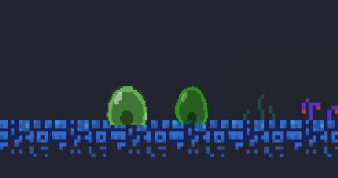

# 🎮 JUJA-SLIME

> Una demo para mi juego plataformas sobre este slime que ha perdido su gorra
---

## 🌟 Características Principales
*   **Plataformas Clásico:** Mecánicas pulidas de salto y movimiento.
*   **Desafío Progresivo:** Niveles diseñados para poner a prueba tus reflejos.
*   **Secretos:** Áreas ocultas para los jugadores más curiosos.

---

## ⌨️ Guía de Controles
Ten en cuenta que puedes clonarte, por tanto, el primer input de 
los controles es para el original, y el segundo es para el clon

Puedes jugar usando el teclado:

| Acción | Teclado |
| :--- | :--- |
| **Moverse** | `A` `D` / `Flechas` |
| **Saltar** | `A` / `Down Arrow` |
| **Atacar** | `Q` / `Right Control` |
| **Disparar / Interactuar** | `E` / `Right Shift` |
| **Clonarse** | `F` |

---

## 🛠️ Cómo Empezar

1.  Clica en el siguiente enlace para empezar a jugar! [JUJA - SLIME](https://aviking133.github.io/Juja-Slime./)
2.  Crea una cuenta desde el menu de register

3.  Luego inicia sesión desde el menu de Login

4.  Ya puedes jugar!

> **Nota:** La primera vez puede tardar unos segundos en cargar

---

## 🗺️ Elementos del Juego

### Personajes
*   **Protagonista:** Juja, un valiente slime que ha perdido su gorra.
*   **Enemigos:** Cuidado con los jujers, son parte del *c caga* team.

### Power-ups
*   ⚡ **Slime:** Recupera un punto de vida y municion.

## 🗺️ Tutorial del juego

### Movimiento horizontal

Puedes moverte horizontalmente por el terreno con las teclas A y D, y 
para controlar el clon las flechas de direccion derecha e izquierda

### Salto cargado

Puedes saltar normalmente pulsando la tecla S, o la flecha hacia abajo en 
caso del clon, pero OJO! Puedes cargar el salto para alcanzar mayor altura

### Ataque melee

Para hacer un ataque de corta distancia puedes pulsar
la tecla Q o el Ctrl derecho en caso del clon

### Disparo

Para hacer un disparo puedes pulsar la tecla E, o el Shift derecho en caso 
del clon, ten en cuenta que las municiones interactuan con el entorno

> **Nota:** Ten en cuenta que la municion es la vida, asi que elige bien cuando disparar

### Clonarse

Para clonarte pulsa la tecla F, crearas una copia de ti mismo por 10s, 
este clon de JUJA puede disparar y atacar a melee. Una vez que lo gastes
y este desaparezca, se convertirá en un objeto que tendrás que recoger
para volver a contar con la habilidad.

---

## 🚀 Requisitos del Sistema
*   **SO:** Windows 10 o superior / macOS / Linux.
*   **Procesador:** Dual Core 2.0 GHz.
*   **Memoria:** 2 GB de RAM.
*   **Navegador:** Funciona desde cualquier navegador

---

## 🤝 Créditos y Atribuciones
*   **Desarrollo y Código:** Victor Carús

---

## 📄 Licencia
Este proyecto está bajo la Licencia [MIT/GPL/Creative Commons]
